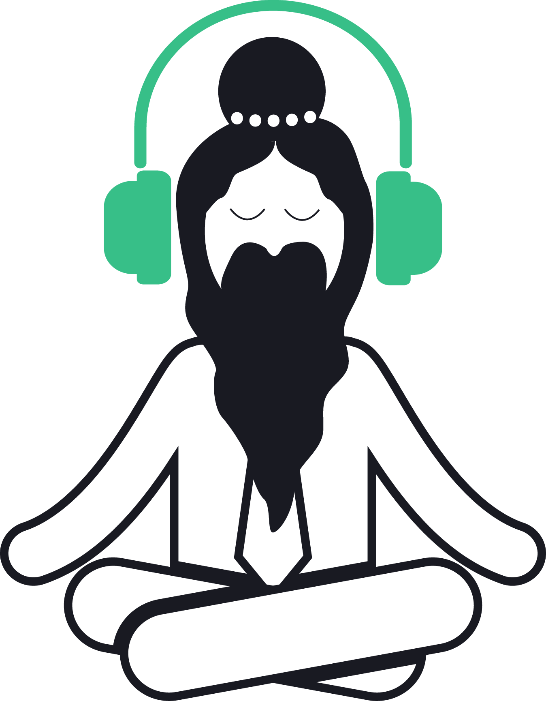

# The Chillout App

*A modern web radio platform.*

Created with React, TypeScript and Styled Components, this app features a responsive layout and a local Favorites collection which renders different components based on viewport width. The app enables users to swap between radios with ease and enjoy a personalized experience without having to leave the page.

Simply click on a radio and enjoy the music! [Tune in to your groove.](https://kostaslib.github.io/chillout/)

You can also add this app to your home screen on any device:
* On mobile, open in Chrome, click the **three dots** in the right corner and select **Add to Home Screen**.
* On desktop, open in Chrome, click the **three dots** in the right corner, select **More Tools** and **Create Shortcut**.

## Update
The app has been re-written from scratch with React and entirely custom CSS. 

* Improved perceived and actual performance
* Added better mobile support layout improvements, including indicators for playing and selected radio, stream loading and initial page loading to prevent FOUC
* Fixed a bug that caused the browser to continue downloading from the stream source after the user paused a radio. The app should no longer consume cellular data when not streaming and it should now always play fresh content
* Added a local favorites collection, which can be customized from several places across the app
* Added a link to active radio's website - if available

## TODOs
* Add image placeholders to prevent upfront downloading and use the Intersection Observer to load them lazily.
* Add Nodejs back end to implement user profiles and save favorites.
* Add customizable collections.
* Import playlists from Spotify.
* Add fingerprinting / music recognition and link to spotify a) https://developer.spotify.com/ b) https://audd.io/ c) https://developer.gracenote.com/web-api d) https://www.acrcloud.com/ e) http://www.sonicapi.com/
* Add rotating images from unsplash. https://unsplash.com/developers
* Add different themes or rotating themes based on time of day.
* Add different views for the radio items (grid view, etc).
* Prompt the user to Add to Home Screen on mobile.

## Acknowledgements
The logo for this app was created with assets from [The Noun Project](https://thenounproject.com/).
